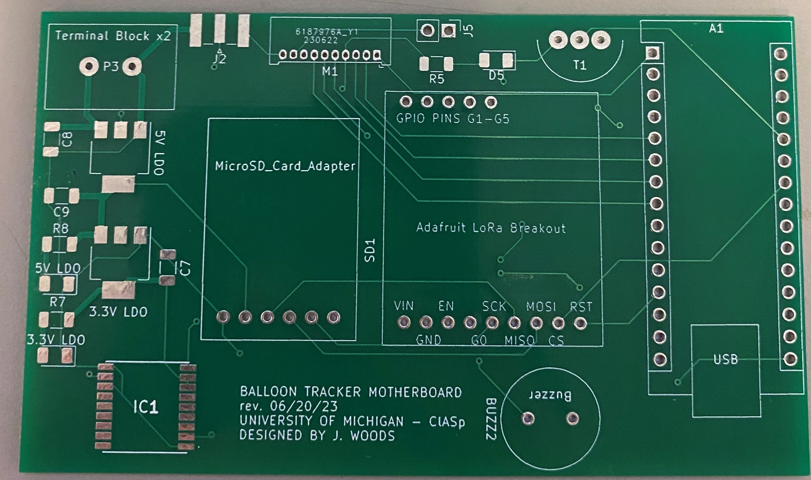
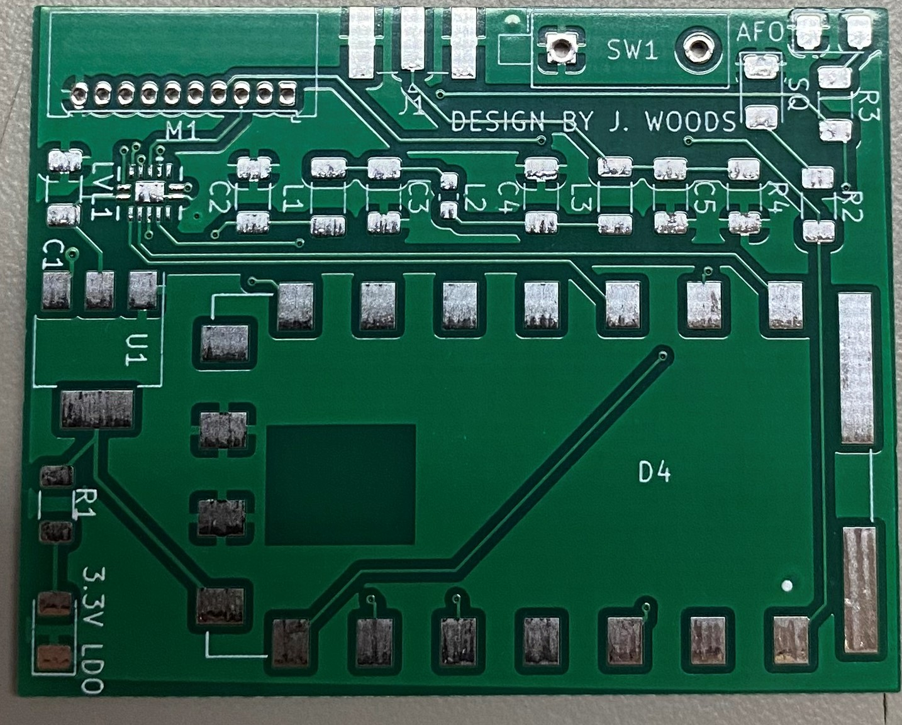

# Design

## Revision 1
Knowing pretty much nothing about designing circuit boards, this revision was a little... interesting. I only choose to include it here to show how the design started and how I learned more about the process from this first step. I am much more proud of revision 2. 

These first boards were definitely a step in the right direction, but they needed some work. The level shifter wound up being near impossible for me to solder correctly, so I knew Rev. 2 would use a larger form factor of the same component. The motherboard was also poorly laid out and the traces were far too narrow for the current they were carrying.