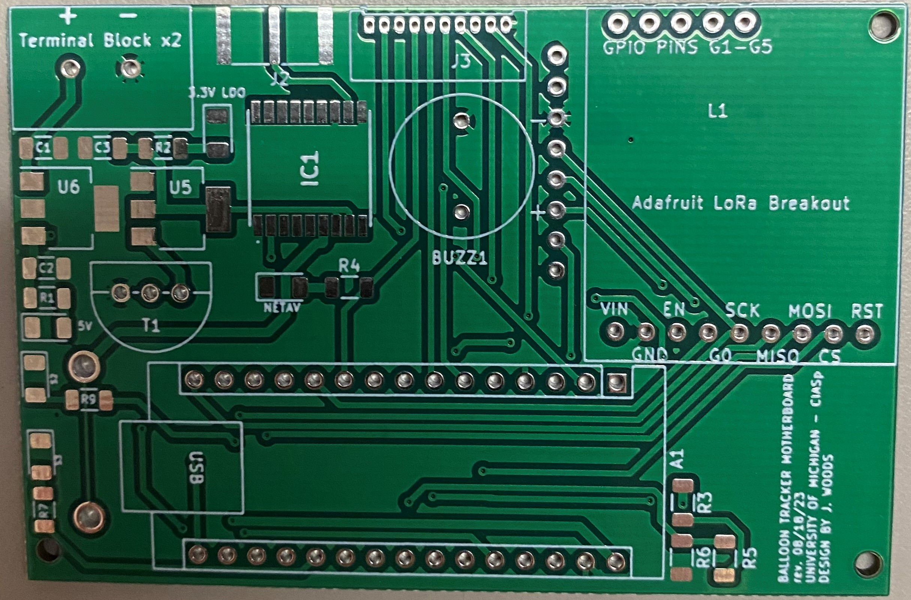
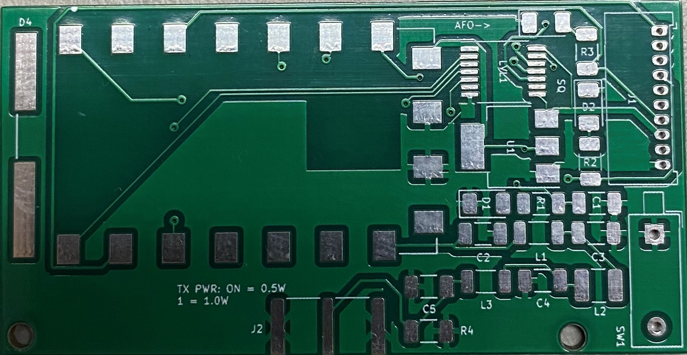
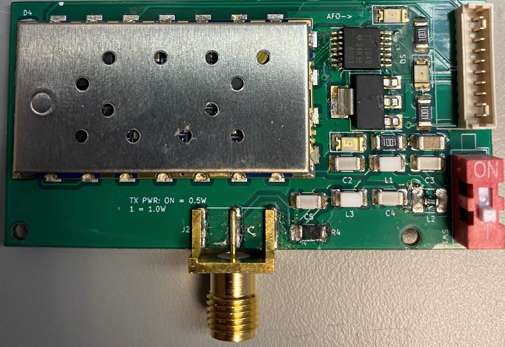

# Designs

## Revision 1
Knowing pretty much nothing about designing circuit boards, this revision was a little... interesting. I only choose to include it here to show how the design started and how I learned more about the process from this first step. I am much more proud of revision 2. 

*Figure 1.1: Revision 1 Motherboard*

This is what I came up with initially. The 10 pin through hole connector at the top is for connecting either a HAM module or RockBlock 9603.

*Figure 1.2: Revision 1 Motherboard*

This is what I came up with initially for the HAM module. This board includes a level shifter for communicating with the motherboard, as well as a low pass filter for the antenna signal.

These first boards were definitely a step in the right direction, but they needed some work. The level shifter wound up being near impossible for me to solder correctly, so I knew Rev. 2 would use a larger form factor of the same component. The motherboard was also poorly laid out and the traces were far too narrow for the current they were carrying.

## Revision 2
I learned a LOT from revision 1. Understanding the problems I was trying to solve much better, I came up with revision 2.

*Figure 2.1: Revision 2 Motherboard*

I like this design a lot. The traces are wider, I used a grounding pour on the top and bottom layers for heat dissipation and EMI, and I rearranged the components (including moving the SD module to the back) to shrink the board by ~25%.

*Figure 2.2: Revision 2 Motherboard with power and GPS circuitry*

*Figure 2.3: Revision 2 HAM Module*

Although I rearranged some components, including swapping the level shifter for a larger one, the board stayed almost the exact same size. 

*Figure 2.4: Completed Rev. 2 HAM Module*

Knowing nothing about PCB design as an aerospace student with a background in mechanical work from MRacing, I am proud of myself for these designs. I took a leap into something new, and can't wait to work on this system more. 